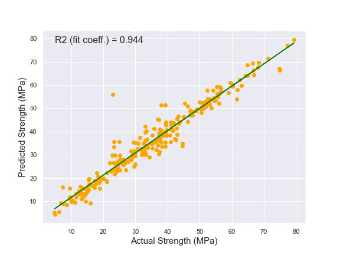

# concrete_strength
------------------------------------------------
## Prediction of concrete compressive strength (MPa) as a function of its composition and age

#### Continious numeric value for comressive strength of concreate was predicted using several algorithms, such as Linear Regression, Decision Tree, Random Forest, Bagging and Gradient Boosting Regressors. Because concrete is a highly nonlinear function of age and ingredients, Random Forest and Gradient Boosting Regressors outperformed Linear Regression, Ridge and Lasso algorithms. Grid and Randomized searches were applied for tuning of chosen algorithms. 

##### Feature engineering was critical to obtain good predictive power due to the non-normal distribution of numerical values, expecially those with large number of zero values, resulting in double gaussian shapes. 

Feature engineering approach was done by combining multiple variables to ratios and total weights, with a goal to see if certain combinations / ratios can help me detect patterns and reorganize the variables to drive the models (since all ingredients (except age) are in the same units of kg/m3).

Found feature imprtances:

 
 
 Predicted vs. actual concrete strength values:
 
 

